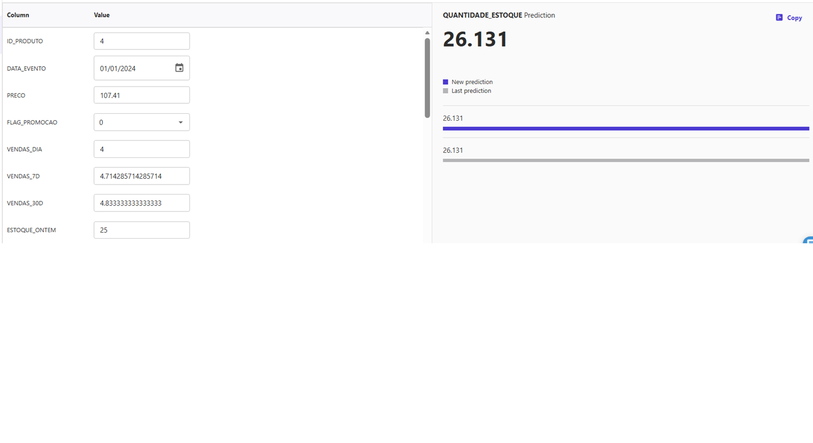
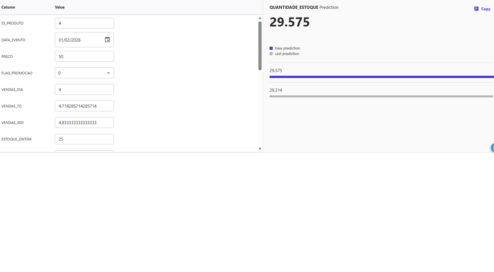

# 📊 Previsão de Estoque Inteligente na AWS com [SageMaker Canvas](https://aws.amazon.com/pt/sagemaker/canvas/)

Bem-vindo ao desafio de projeto "Previsão de Estoque Inteligente na AWS com SageMaker Canvas. Neste Lab DIO, você aprenderá a usar o SageMaker Canvas para criar previsões de estoque baseadas em Machine Learning (ML). Siga os passos abaixo para completar o desafio!

## 📋 Pré-requisitos

Antes de começar, certifique-se de ter uma conta na AWS. Se precisar de ajuda para criar sua conta, confira nosso repositório [AWS Cloud Quickstart](https://github.com/digitalinnovationone/aws-cloud-quickstart).

## 🎯 Objetivos Deste Desafio de Projeto (Lab)

- Dê um fork neste projeto e reescreva este `README.md`. Sinta-se à vontade para detalhar todo o processo de criação do seu Modelo de ML para uma "Previsão de Estoque Inteligente".
- Para isso, siga o [passo a passo] descrito a seguir e evolua as suas habilidades em ML no-code com o Amazon SageMaker Canvas.
- Ao concluir, envie a URL do seu repositório com a solução na plataforma da DIO.

## 🚀 Passo a Passo

### 1. Selecionar Dataset

-   Navegue até a pasta `datasets` deste repositório. Esta pasta contém os datasets que você poderá escolher para treinar e testar seu modelo de ML. Sinta-se à vontade para gerar/enriquecer seus próprios datasets, quanto mais você se engajar, mais relevante esse projeto será em seu portfólio.
-   Escolha o dataset que você usará para treinar seu modelo de previsão de estoque.
-   Faça o upload do dataset no SageMaker Canvas.

A base de dados escolhida para treinamento foi:

- dataset-1000-com-preco-promocional-e-renovacao-estoque.csv.

### 2. Construir/Treinar

-   No SageMaker Canvas, importe o dataset que você selecionou.
-   Configure as variáveis de entrada e saída de acordo com os dados.
-   Inicie o treinamento do modelo. Isso pode levar algum tempo, dependendo do tamanho do dataset.

Estrutura das Colunas: 

| Campo                  | Descrição                                                |
|------------------------|--------------------------------------------------------  |
| **ID_PRODUTO**         | Identificador único do produto. Agrupa a série temporal. |
| **DATA_EVENTO**        | Data de registro do evento. Usada como eixo temporal.    |
| **PRECO**              | Preço do produto na data. Pode influenciar demanda.      |
| **FLAG_PROMOCAO**      | Indicador 0/1 para promoções. |
| **QUANTIDADE_ESTOQUE** | Quantidade em estoque no dia. É o alvo da previsão. |

Para análise utilizaremos a variável **QUANTIDADE_ESTOQUE** como alvo da previsão.

Para esta análise utilizaremos um modelo de regressão supervisionada.

| Métrica            | Significado                         | Ideal                                 |
|--------------------|--------------------------------------|----------------------------------------|
| **MAPE**           | Erro percentual médio                | Quanto menor, melhor (<20% é bom)      |
| **RMSE**           | Penaliza erros grandes               | Baixo valor = modelo estável           |
| **MAE**            | Erro absoluto médio                  | Fácil de interpretar                   |
| **R²**             | Percentual explicado pelo modelo     | 0.7+ é forte                           |

O SageMaker Canvas utiliza um conjunto robusto de métricas para avaliar o desempenho do modelo de previsão. Abaixo estão as principais métricas explicadas de forma clara e objetiva.

🔹 MAPE — Mean Absolute Percentage Error (Erro Percentual Absoluto Médio)

Indica o erro percentual médio entre valores reais e previstos.

< 10%: excelente

10% a 20%: bom

20% a 50%: aceitável, porém com erros perceptíveis

> 50%: pouca precisão

🔹 RMSE — Root Mean Squared Error (Raiz do Erro Quadrático Médio)

Avalia o desvio médio das previsões penalizando mais os erros maiores.

Quanto menor, melhor.

Indicado para modelos sensíveis a grandes variações.

🔹 MAE — Mean Absolute Error (Erro Absoluto Médio)

Mostra o erro médio em unidades absolutas.

Útil para entender “quantos itens o modelo erra em média”.

Menos sensível a outliers que o RMSE.

🔹 R² — Coeficiente de Determinação

Indica o quanto o modelo explica da variabilidade dos dados.

1.0: modelo perfeito

>0.7: forte

0.5–0.7: moderado

<0.5: baixo poder preditivo

### 3. Analisar

-   Após o treinamento, examine as métricas de performance do modelo.
-   Verifique as principais características que influenciam as previsões.
-   Faça ajustes no modelo se necessário e re-treine até obter um desempenho satisfatório.

As métricas obtidas foram as seguintes:

| Métrica     | Interpretação                                          |
| ----------- | ------------------------------------------------------ |
| RMSE = 26,7 | Erro relativamente alto                                |
| MAE = 19,2  | Erro significativo                                     |
| R² = 0,17   | Modelo fraco (não explica o estoque)                   |
| MAPE = N/A  | Canvas não conseguiu gerar (provável zeros no estoque) |

As métricas indicam um modelo muito pobre.

- RMSE = 26,756

Isso significa que o modelo erra em média ≈ 27 unidades de estoque, com penalização de erros maiores.

Se o estoque médio é 200, um erro de 27 é ≃ 13%.

Se o estoque médio é 50, um erro de 27 é péssimo (≃ 54%).

O RMSE relativamente alto sugere dificuldade em capturar padrões.

- MSE = 715,859

É apenas o RMSE ao quadrado, não muito útil para interpretação.

- MAE = 19,198

Erro médio absoluto ≈ 19 unidades de estoque.

Isso já é mais fácil de interpretar:

Se seu estoque típico varia entre 0 e 100, um erro de 19 é muito alto.

O MAE também sugere um erro numérico considerável.

- R² = 17,246% (0,17)

Esse é o ponto mais crítico.

O modelo só consegue explicar 17% da variação real do estoque.

Na prática isso significa:

- O modelo está muito fraco.
- Mesmo que os erros numéricos (RMSE/MAE) pareçam “aceitáveis”, ele NÃO está capturando corretamente os padrões.
- 83% da variação do estoque está sendo perdida.

Há uma dispersão grande de dados de QUANTIDADE_ESTOQUE.

Para ajustar o modelo de previsão de estoque inteligente, criei uma nova base de dados fictícia com mais features:

| Campo                  | Descrição                                                |
|------------------------|--------------------------------------------------------  |
| **ID_PRODUTO**         | Identificador único do produto. Agrupa a série temporal. |
| **DATA_EVENTO**        | Data de registro do evento. Usada como eixo temporal.    |
| **PRECO**              | Preço do produto na data. Pode influenciar demanda.      |
| **FLAG_PROMOCAO**      | Indicador 0/1 para promoções. |
| **VENDAS_DIA**             | Demanda do dia |
| **VENDAS_7D**              | Demanda do 7 dias |
| **VENDAS_30D**             | Demanda do 30 dias |
| **QUANTIDADE_ESTOQUE** | Quantidade em estoque no dia. É o alvo da previsão. |
| **ESTOQUE_ONTEM** |  Estoque de ontem |
| **ESTOQUE_7_DIAS_ATRAS** | Estoque de 7 dias atrás |
| **VARIACAO_ESTOQUE** | Variação de estoque |
| **MEDIA_ESTOQUE_7D** | Media de estoque de 7 dias  |
| **CATEGORIA** | Categoria |
| **SUBCATEGORIA** | Subcategoria  |
| **MARCA** |  Marca do produto |
| **TEMPO_REPOSICAO** | Tempo de reposição |
| **FORNECEDOR** | Fornecedor  |
| **DIA_DA_SEMANA** | Dia da semana |
| **MES** | Mes  |
| **SEMANA_DO_ANO** | Semana do no |
| **FERIADO** | Feriado |
| **FIM_DE_SEMANA** | Fim de semana  |

Métrica da nova base de dados:

| Métrica     | Interpretação                                          |
| ----------- | ------------------------------------------------------ |
| RMSE = 3.64 | Erro relativamente alto                                |
| MAE = 2.099  | Erro significativo                                     |
| R² = 98.266%   | Modelo fraco (não explica o estoque)                   |
| MAPE = N/A  | Canvas não conseguiu gerar (provável zeros no estoque) |

Como podemos avaliar este modelo de regressão de avaliação o estoque:

- RMSE = 3.64

Indica que, em média, o erro entre o valor previsto e o real é 3,64 unidades de estoque.

- Muito bom, se o estoque normalmente varia em valores maiores (ex.: dezenas ou centenas).

- MSE = 13.25

É apenas o RMSE ao quadrado.
Não é tão interpretável, mas confirma que o erro médio é baixo.

- MAE = 2.099

O modelo erra 2 unidades de estoque, em média.
➡ MAE é excelente porque é simples:
“o modelo erra 2 unidades para mais ou menos”.

- R² = 98.266%

Seu modelo explica 98% da variação do estoque.

➡ Para negócios, isso significa:
O modelo captura praticamente toda a dinâmica da movimentação de estoque.
Esse é um valor extremamente alto — típico de modelos muito bem ajustados ou bases simples/pequenas.

Com R² muito alto (98%), é bom verificar:

O desempenho no treinamento é parecido com o de teste?

O SageMaker Canvas está usando validação automática k-fold?

Um R² extremamente alto pode indicar:

- Modelo muito bom
ou
- Overfitting (principalmente se os dados forem poucos ou muito limpos).

❗ MAPE = Not Available

O MAPE não é calculado quando existe valor zero na variável alvo.

Como estoque pode ser zero, faz sentido.

Há uma dispersão grande de dados de QUANTIDADE_ESTOQUE.

### 4. Prever

-   Use o modelo treinado para fazer previsões de estoque.
-   Exporte os resultados e analise as previsões geradas.
-   Documente suas conclusões e qualquer insight obtido a partir das previsões.

Previsão de estoque:

Previsão de QUANTIDADE_ESTOQUE na DATA 01/01/2024

Previsão de QUANTIDADE_ESTOQUE na DATA 01/02/2026

## 🤔 Dúvidas?

Esperamos que esta experiência tenha sido enriquecedora e que você tenha aprendido mais sobre Machine Learning aplicado a problemas reais. Se tiver alguma dúvida, não hesite em abrir uma issue neste repositório ou entrar em contato com a equipe da DIO.
